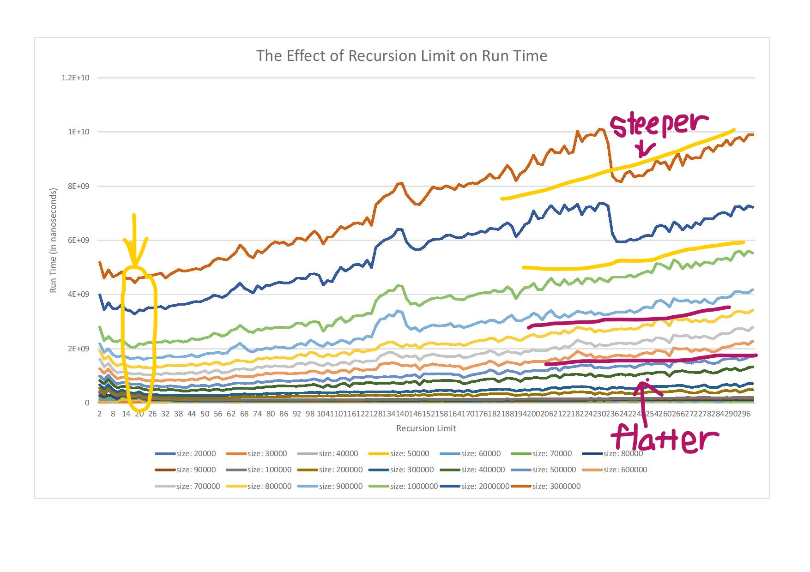

####HTML code
```html
<!DOCTYPE html>
<html lang="en">
<head>
    <meta charset="UTF-8">
    <title>Title</title>
</head>
<body>
    <h3>Analysis on the Result</h3>
    <picture>
        
    </picture>
    <dl>
      <dt>Overall Trend:</dt>
      <dd>- At the beginning of each line, the line tends to go down a little bit, where each meet the minimum</dd>
      <dd>  when the recursion limit is around 18, close to the "15" that we see in the modules.
      <dd>- The run time of smaller arrays doesn't get affected as much when the recursion limit increases.</dd>
      <dt>Zoom-in part:</dt>
      <dd>- white cold drink</dd>
    </dl>

    <picture>
        
    </picture>
</body>
</html>
```